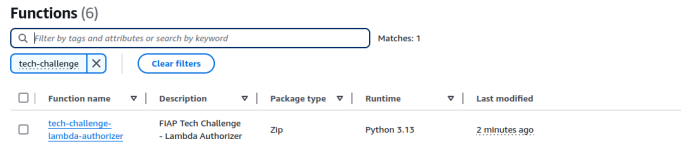

# Tech Challenge - Lambda Auth

 

## 💻 Descrição

Este repositório é responsável criar a lambda authorize.

## 🛠 Tecnologias Utilizadas

## ⚙️ Configuração

### Pré-requisitos

1. É necessário executar a pipeline para criar o VPC no repositório: https://github.com/fiap-soat-12/tech-challenge-vpc
2. É necessário executar a pipeline para criar o RDS no repositório: https://github.com/fiap-soat-12/tech-challenge-db
3. É necessário executar a pipeline para criar o SQS no repositório: https://github.com/fiap-soat-12/tech-challenge-queue
4. É necessário executar a pipeline para criar a imagem no ECR no repositório e a Infraestrutura da Cook API: https://github.com/fiap-soat-12/tech-challenge-cook-api
5. É necessário executar a pipeline para criar a imagem no ECR no repositório e a Infraestrutura da Order API: https://github.com/fiap-soat-12/tech-challenge-order-api
6. É necessário executar a pipeline para criar a imagem no ECR no repositório e a Infraestrutura da Payment API: https://github.com/fiap-soat-12/tech-challenge-payment-api
7. É necessário executar a pipeline para criar o Cluster e a Infraestrutura no repositório: https://github.com/fiap-soat-12/tech-challenge-k8s

### Desenvolvimento

- **[Terraform](https://www.terraform.io/)**: Site oficial do Terraform.
- **[AWS](https://aws.amazon.com/pt/)**: Site oficial da AWS.
- **[Python](https://docs.python.org/pt-br/3/)**: Documentação oficial do Python.

## 🚀 Execução

### Subindo a Lambda Authorize

  Caso deseje subir a lambda authorize, basta seguir os seguintes passos:
  
  1. Certificar que o Terraform esteja instalado executando o comando `terraform --version`;
  

  2. Certificar que o `aws cli` está instalado e configurado com as credenciais da sua conta AWS;
  

  3. Acessar a pasta `terraform` que contém os arquivos que irão criar a lambda authorize;
  4. Inicializar o Terraform no projeto `terraform init`;
  5. Verificar que o script do Terraform é valido rodando o comando `terraform validate`;
  6. Executar o comando `terraform plan` para executar o planejamento da execução/implementação;
  7. Executar o comando `terraform apply` para criar a lambda authorize;
  8. Após a execução do Terraform finalizar, verificar se a lambda authorize subiu corretamente na AWS;
  
